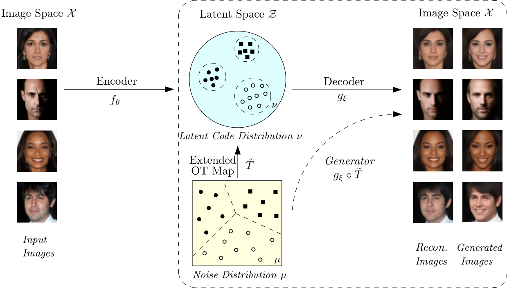
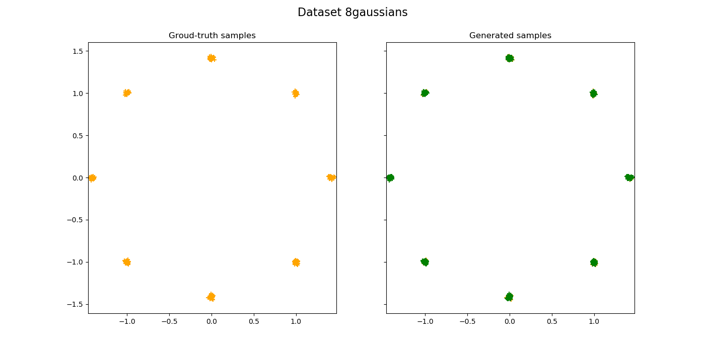
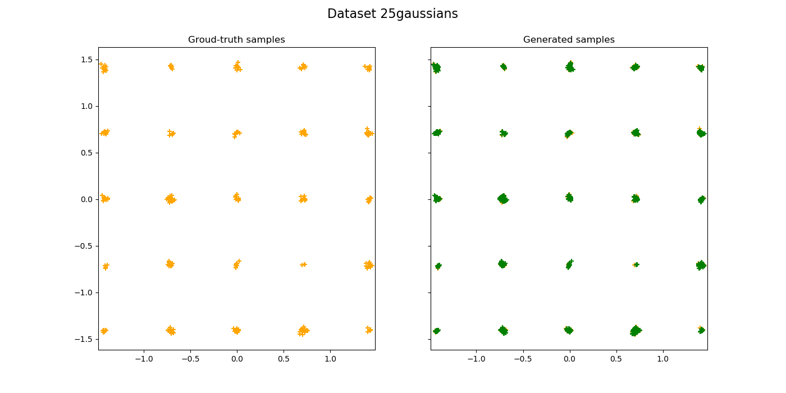
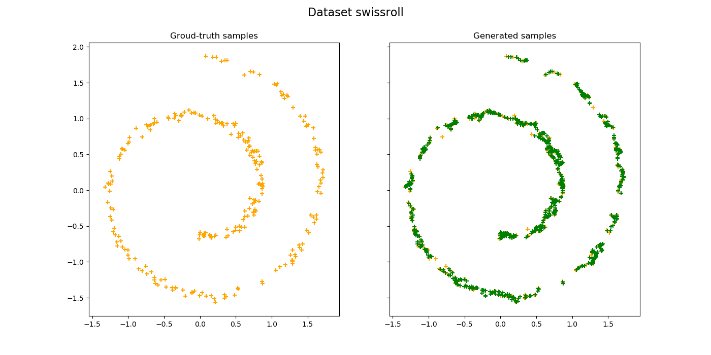
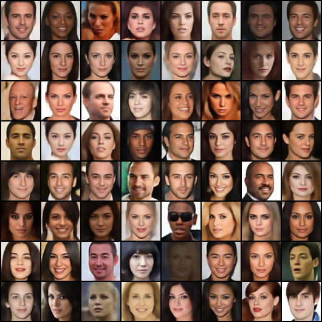

# pyOMT: A Pytorch implementation of Adaptive Monte Carlo Optimal Transport Algorithm

 This work is licensed under a <a rel="license" href="http://creativecommons.org/licenses/by-nc/4.0/">Creative Commons Attribution-NonCommercial 4.0 International License</a>.

The optimal transport problem arises whenever one wants to transform one distribution to another distribution in a *optimal* way. For example, computing measure preserving maps between surfaces/volumes, matching two histograms, and generating realistic pictures from a given dataset in deep learning. 

The Adaptive Monte Carlo Optimal Transport algorithm tackles potentially high-dimensional semi-discrete OT problems in a scalable way by finding the minimum of a convex energy (i.e. the Brenier potential), which induces the optimal transport map from a continuous distribution to a empirical distribution. The energy is optimized by gradient descent method, and at each iteration, the gradient of the energy is estimated using the Monte Carlo integration. 

One application of the OT solver is to generate new samples of a dataset. Intuitively, the generation involves producing new samples near the empirical distribution formed by the dataset samples. With the optimal transport map from a continuous prior distribution (e.g. uniform or Gaussian) to this empirical distribution computed, new samples can be easily generated by sampling in the prior distribution and then mapping it to the dataset distribution with the OT map.

## Reference
    @inproceedings{
    An2020AE-OT:,
    title={AE-OT: A NEW GENERATIVE MODEL BASED ON EXTENDED SEMI-DISCRETE OPTIMAL TRANSPORT},
    author={Dongsheng An and Yang Guo and Na Lei and Zhongxuan Luo and Shing-Tung Yau and Xianfeng Gu},
    booktitle={International Conference on Learning Representations},
    year={2020},
    url={[https://openreview.net/pdf?id=HkldyTNYwH]}
    }

## Implementation
Code is developed in [PyTorch](https://pytorch.org/) for better integration with deep learning frameworks. The code is for research purpose only. Please open an issue or email me at *yangg20111 (at) gmail (dot) com* if you have any problem with the code. Suggestions are also highly welcomed. 

## Dependencies
1. Python=3.6 (or above)
2. PyTorch=1.3.0 (or above)
3. NumPy=1.17.4 (or above)
4. Matplotlib=3.1.0 (or above)

## Demos
### Generation examples on simple measures (i.e. toy sets).
* Code:
  > python demo1.py
 
* Results:
 
 
 

### Generation human face images with AE-OT framework.
  This demo shows the application of the adaptive Monte Carlo OT solver in image generation tasks. Dataset used here is the [*CelebA_crop_resize_64*](http://mmlab.ie.cuhk.edu.hk/projects/CelebA.html) dataset, which contains ~200,000 human face images of resolution 64x64. With the OT solver, infinitely many realistic face images can be generated. 

* Model training and generating:
  > python demo2.py --data_root_train *path-to-your-training-dataset* --data_root_test *path-to-your-test-dataset*

* Generating with pre-trained models:
  
  Download the pre-trained models [here](https://drive.google.com/open?id=1gi9LmF83s3jGEPVPmo1KswFhB0wKv4Ke), extract the files to the "results" folder, and

  > python demo2.py --generate_feature --decode_feature --data_root_train *path-to-your-training-dataset* --data_root_test *path-to-your-test-dataset*

  OR if you want to only use the pre-trained AE model and compute the OT solver yourself:
  > python demo2.py --train_ot --generate_feature --decode_feature --data_root_train *path-to-your-training-dataset* --data_root_test *path-to-your-test-dataset*

* Generated images:

